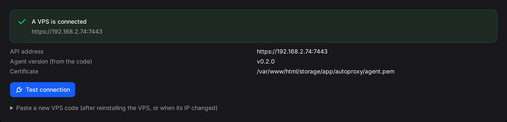
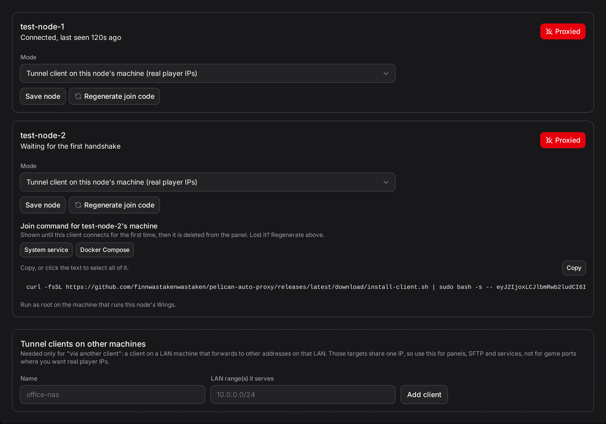

# Pelican Auto Proxy

If your Pelican Panel and game servers run on a home connection, players cannot reach them directly. Pelican Auto
Proxy gives you a public address on a cheap VPS instead. Players connect to that address; your home IP and your
game server's IP are never shown to them. There is nothing to set up on your router.

**Status: early release (0.2.x).** The install below works end to end today. Version 1.0 will add screenshots and a
run on a rented internet-facing VPS; until then, expect small changes to the docs, not to the commands.

## Why you'd want this

- **Your home IP stays hidden.** Players only ever see the VPS's address, never yours.
- **Nothing on your network has to accept connections from the internet.** The connection is started from your side
  going out to the VPS, so there is no port forwarding to configure and nothing listening for strangers to find.
- **It is cheap.** It runs on the smallest VPS any provider sells; the part that runs there uses well under 20 MB of
  memory.
- **It is quick.** Setup takes about five minutes, using commands the plugin writes for you, so you do not need to
  know networking terms to run them.
- **Bans and player logs keep working.** In the normal setup, the game server still sees each player's real IP
  address, not the VPS's.

## What you need

- A small VPS with a public IPv4 address and root access. Any provider's cheapest plan works, running Debian 12 or
  13. Tested live on Debian 13; Debian 12 is expected to work but has not been tested yet. Ubuntu is not supported in
  this release; it is tracked for a later one.
- A Pelican Panel install where you are a root admin, able to import a plugin zip.
- About five minutes and two copy-paste commands.

## Five-minute setup

The plugin generates every command below with your own values, these are examples of the shape, not values to
type by hand. Full walkthrough with a "how to verify" step after each one: [docs/quickstart.md](docs/quickstart.md).

**1. Install the agent on your VPS.** SSH in as root and run:

```bash
curl -fsSL https://github.com/finnwastakenwastaken/pelican-auto-proxy/releases/latest/download/install-vps.sh | sudo bash
```

It prints a **VPS code**: a block of text, not a secret you type from memory. Copy it.

**2. Paste the VPS code into the plugin.** Import the plugin zip (Admin → Plugins → Import), install it, then open
**Admin → Auto Proxy → Setup** and paste the code into step 1.



**3. Add each node.** A node is a machine running your game servers. For every node you want reachable, step 2 of
the same page shows a join command built for that node, either a one-line install or a Docker Compose snippet. Run
it on that node's host as root:

```bash
curl -fsSL https://github.com/finnwastakenwastaken/pelican-auto-proxy/releases/latest/download/install-client.sh | sudo bash -s -- <join code>
```



Within a minute the plugin's Status page shows that node as connected. Type `proxy` or `public` into an
allocation's Alias field and, once a game server is assigned to it, it is reachable from the internet within a
minute too.

## What players see

In the normal setup, the tunnel runs on the same machine as the game server, so players show up with their **real
IP address**. Bans, location-based rules and per-player connection limits all keep working exactly as before.

If instead one machine on your network forwards traffic to other machines on your behalf, every player looks like
they are connecting from that one forwarding machine. This is the same limitation any shared-IP setup has, so use
it only when the tunnel cannot run directly on the game server's own machine.

## Supported layouts

One VPS and one plugin install cover every setup below: everything on one machine, several game servers on your
home network, game servers spread across different providers, or a mix. Full diagrams for each:
[docs/layouts.md](docs/layouts.md).

- **Everything on one machine**, the most common home setup. Real player IPs.
- **Panel on one machine, game servers on others on the same network**, real player IPs.
- **Game servers on other networks or providers**, each connects on its own, real player IPs.
- **Forwarding to other services on your network**, including ones that are not Pelican at all, those services
  share one address, the way a traditional reverse proxy works.

The panel itself never runs a tunnel. Wherever the panel lives, all it needs is an outbound connection to the VPS.

## Docs

- [Quick start](docs/quickstart.md): the steps above in full, with a way to check that each one worked.
- [Supported layouts](docs/layouts.md): four ways to arrange your panel, game servers and the VPS.
- [Installing the VPS agent](docs/install-vps.md)
- [Installing the node client](docs/install-client.md)
- [Using the plugin](docs/plugin.md)
- [Security](docs/security.md)
- [Troubleshooting](docs/troubleshooting.md)
- [Updating](docs/updating.md)
- [Uninstalling](docs/uninstall.md)
- [FAQ](docs/faq.md)
- [Running the node client under Coolify](docs/coolify.md)
- [Migrating from frp or playit.gg](docs/migrating-from-frp-or-playit.md)
- [Architecture (for contributors)](docs/dev/architecture.md)
- [Testing (for contributors)](docs/dev/testing.md)
- [Cutting a release (for contributors)](docs/dev/release.md)

## Security in one paragraph

Your game server machine connects out to the VPS; nothing on your network accepts connections coming in from the
internet, so there is nothing for someone scanning your home IP to find. Players only ever see the VPS's address,
never your home IP or your game server's IP. The code the plugin gives you to connect a node works like a password
rather than a one-time code: keep it as private as you would a password, because anyone who has it can join your
tunnel as that node. Full details: [docs/security.md](docs/security.md).

## License

[MIT](LICENSE).
