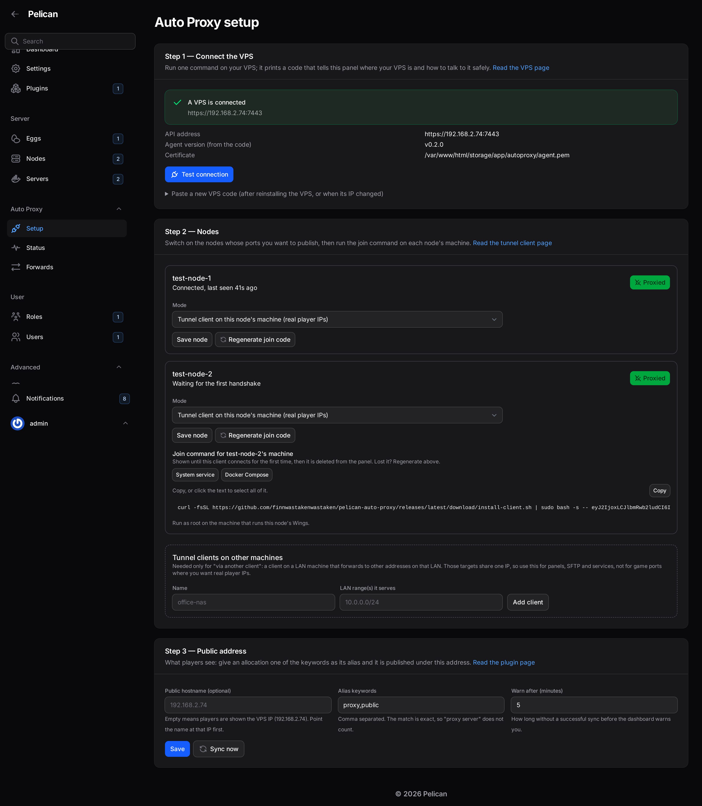
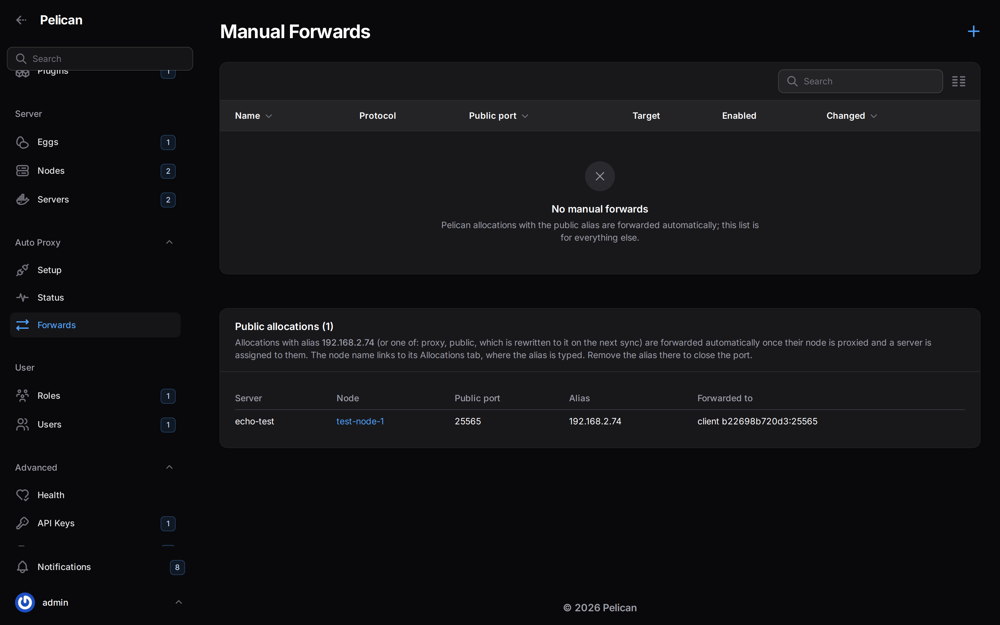
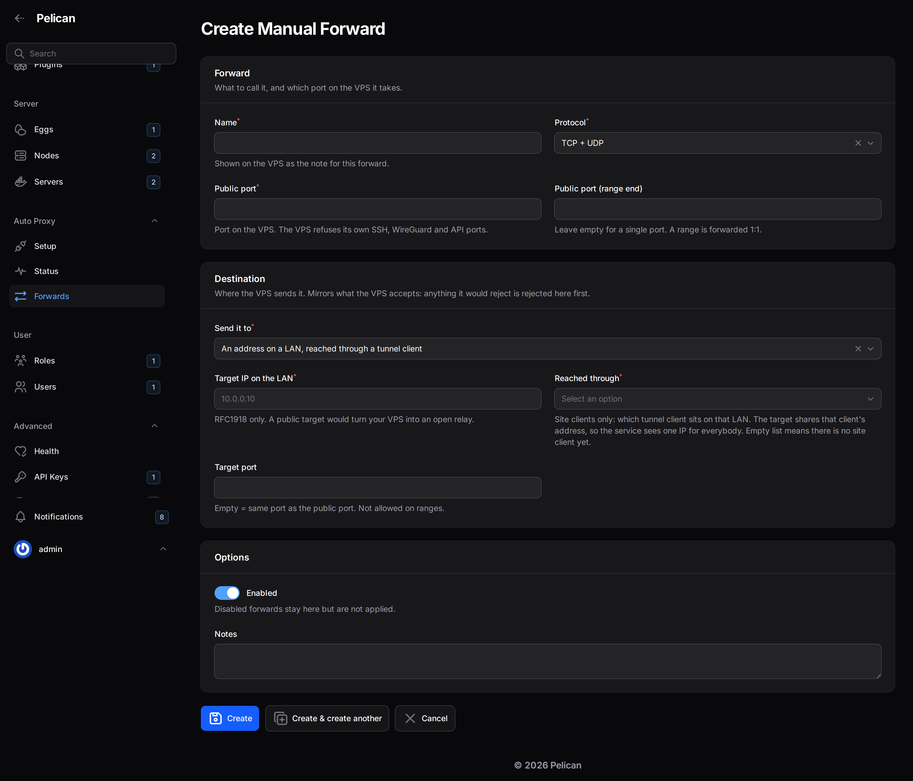
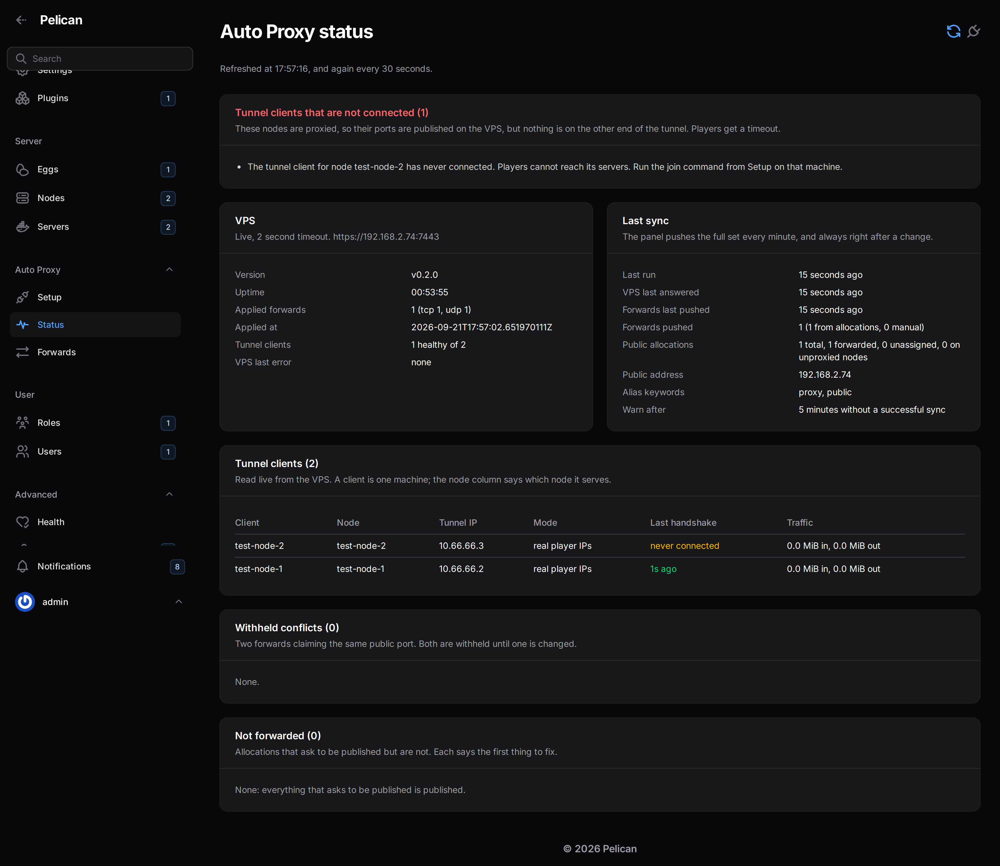

# Using the plugin

Everything below is under **Admin → Auto Proxy** in the panel sidebar, visible to root admins only. Any other admin
sees no Auto Proxy page, resource or banner at all — the token stored by the plugin can open ports on your VPS, so
only root admins can see or touch it.

## Setup page



Three steps, each generating commands with your own values filled in — you should not need to type an IP, port or
token by hand anywhere on this page.

**Step 1 — connect to the VPS.** Paste the VPS code printed by `install-vps.sh` (see
[install-vps.md](install-vps.md)). Press **Test connection**. A green state means the panel reached the agent's
HTTPS API and the certificate matched what the code promised; the plugin stores the endpoint, port, pinned
certificate and token from here on (the token encrypted in the database; the certificate as a file in the panel's
storage folder plus a copy in the database, so updating the panel container does not lose it). A red state means the panel could not reach that address and port — check this
from wherever the panel itself runs, since a panel hosted elsewhere needs its own network path to the VPS.

**Step 2 — add nodes.** One row per Pelican node. For each node you want reachable:

- Toggle it **proxied**.
- Choose its mode: **this host runs the client** (real mode, real player IPs) or **forwarded from another host on
  this LAN** (site mode — give the LAN IP of the machine that will run the client).
- The row then shows a **join command**, in system-service and Docker tabs with a copy button, and a live **peer
  status** once you've run it: handshake age, "never joined", or "stale" if the handshake is older than a few
  minutes.
- Once the client reports it (0.3.0 clients with a 0.3.0 agent), a line under the status gives the **client version**
  and whether an update is available, plus the progress of an update you asked for on the Status page, where the
  update itself is done.

**Step 3 — public hostname and aliases.** Optional public hostname (shown to players instead of the bare VPS IP once
set) and the alias keywords that mark an allocation public (`proxy` and `public` by default — see "Alias rules"
below).

Every step links to the matching page in this documentation.

## Setting up without a browser

Every step above is also available as a panel command, for unattended installs, scripted rebuilds and panels where
nobody opens the admin UI. It calls the same code the Setup page calls, so the page and the command cannot behave
differently. Run these from the panel's directory, as the panel's user:

```
php artisan autoproxy:setup store-code --code-file=/path/to/vps-code.txt
php artisan autoproxy:setup test
php artisan autoproxy:setup nodes
php artisan autoproxy:setup enable-node <id-or-name> --mode=real
php artisan autoproxy:setup enable-node <id-or-name> --mode=site --via-peer=<peer-id> --lan-ip=10.0.0.10
php artisan autoproxy:setup disable-node <id-or-name>
php artisan autoproxy:setup join-command <id-or-name>
```

`store-code` stores the VPS code and tests the connection straight away; prefer `--code-file` over `--code=`,
because an argument is visible in `ps` and in your shell history. `nodes` lists your nodes with their mode, peer id
and whether a join code is stored. `enable-node` in real mode creates the tunnel client on the VPS and stores its
join code; in site mode it needs `--via-peer` and `--lan-ip`. `disable-node` removes that client from the VPS and
closes its ports. `join-command` prints the install line for that node's machine — that line contains the client's
private key, so treat it like a password.

Tunnel clients on machines that are not Pelican nodes — the ones site mode and manual forwards route through —
and manual forwards themselves have commands too:

```
php artisan autoproxy:setup clients
php artisan autoproxy:setup add-client --name="office switch" --lan-cidrs=10.0.0.0/24,192.168.4.0/24
php artisan autoproxy:setup client-join-command <peer-id>
php artisan autoproxy:setup remove-client <peer-id>

php artisan autoproxy:setup forwards
php artisan autoproxy:setup add-forward --name="wings api" --proto=tcp --public-port=8080 \
    --target-peer=<peer-id> [--target-port=8080] [--notes="..."] [--disabled]
php artisan autoproxy:setup add-forward --name="panel" --proto=tcp --public-port=8080 \
    --target-ip=10.0.0.10 --via=<peer-id> [--target-port=80] [--notes="..."] [--disabled]
php artisan autoproxy:setup add-forward --name="game range" --proto=both --public-port=27000 \
    --public-port-end=27010 --target-ip=10.0.0.20 --via=<peer-id>
php artisan autoproxy:setup remove-forward <id>
```

`clients` lists every tunnel client the VPS knows: peer id, name, mode, tunnel IP, LAN ranges, last handshake, the
node that owns it if any, and whether the panel still holds its join code. `add-client` creates a site-mode client
and prints its peer id, tunnel IP and join command. The VPS has the last word on the LAN ranges — it refuses a
range that covers its own public address or the tunnel subnet — and its refusal is printed word for word, because
it names the range and the reason.

`client-join-command` prints the join command again while the panel still holds that client's code. Once the code
is gone there is no way to read it back from the VPS: the only way to get a working command is a **new keypair**,
which stops whatever is connected on the old key until it is re-run. That path warns first and does nothing
without `--yes`.

`remove-client` deletes the client and closes its ports, and switches off any node reached through it. It refuses a
client that belongs to a node — use `disable-node` for those, so the panel's copy is cleared too.

`add-forward` creates a manual forward and pushes it straight away. It takes one of the two destinations the
Forwards form offers:

- `--target-peer=<peer-id>`: a machine that runs its own real-IP tunnel client, which sees real client addresses.
  This is how Wings' API (8080) and SFTP (2022) on a proxied node are published: the node's peer id is in the
  `nodes` and `clients` lists. The client must be in real-IP mode; a site client is refused.
- `--target-ip=<address> --via=<peer-id>`: an address on a LAN, reached through the site client on that LAN.

Giving both, or neither, is refused. Everything is checked against exactly the same rules as the Forwards form, in
the same words: the right kind of client for each destination, a private (RFC1918) LAN target inside the ranges its
client covers, ports in 1–65535, a range end at or above the start, and no target port on a range.
`remove-forward` deletes one by the id `forwards` shows, and pushes.

The Setup page stays the normal path, and the one this page describes. The plugin's other command is
`autoproxy:sync`, run every minute by the panel's scheduler (see "Sync timing" below).

## Forwards page



Lists every forward the VPS is currently applying: Pelican allocations marked public, and any manual forwards you
added directly (see below). Read-only for allocation-based forwards — the alias field on the allocation is the
only control for those; this page just shows the result. Each row shows the public port, the target, and whether it
is currently applied or withheld (see "conflicting forwards" under Banner meanings).

### Adding or editing a manual forward



The form is one page in three sections — Forward (name, protocol, public port or port range), Destination (a tunnel
client, or an address on a LAN reached through one) and Options (enabled, notes) — with **Save** and **Cancel** at
the bottom. `Ctrl`/`Cmd`+`S` saves as well.

### Manual forwards

For services that are not Pelican allocations at all — the panel itself, Wings' own port, SFTP, or anything else you
want reachable through the same VPS. Add one here with a public port, a target (host + port on your LAN), and a
protocol. The same validation the VPS applies to plugin-generated rules applies here: the target must be a private
address, the public port must not already be reserved (SSH, the WireGuard port, the API port) or claimed by another
forward, and a port range cannot remap to a different port.

## Status page



The page refreshes itself every 30 seconds and shows the time of the last refresh at the top, so it can be left
open on a second screen while you fix something. **Sync now** and **Test VPS** still work at any moment.

- **Tunnel clients that are not connected**: proxied nodes whose tunnel client has not handshaked inside the warn
  window, or never has. Their ports are open on the VPS with nothing behind them, which players see as a timeout.
- **The panel reaches these nodes through the VPS**: nodes whose hostname resolves to the VPS's address from the
  panel itself (a hosts entry counts, which is the fix). The panel's own calls to Wings then take the tunnel, and
  Pelican gives its status call one second, so those nodes flicker offline and their console pages show 403 errors.
  Each entry names the node, the hostname and what to do, and links to
  [Let the panel reach this node directly](node-setup.md#let-the-panel-reach-this-node-directly). The lookups run in
  the background from the scheduled sync, every ten minutes, a two-second limit per name; the page only reads the
  stored answer, so it never waits on DNS. **Check again** looks again now, after you added the hosts entry. A name
  that could not be looked up is not reported.
- **Agent**: live answer from the VPS — version, uptime, how many rules are currently applied, and the freshest
  WireGuard handshake age across all peers. "Unreachable" here means the panel cannot push new rules to the VPS
  right now; it does not mean players are disconnected — the VPS keeps serving whatever it last applied.
- **Per-node peer status**: same handshake-age view as Setup step 2, in one place for every node at once.
- **Client version** column: what each tunnel client last reported to the VPS, and "update: X" when a newer release
  exists.
- **Tunnel client updates**: one card per client with its version, whether it is up to date, the command that
  updates it (with a Copy button), and progress of an update you asked for. The latest release is read from the same
  `update.json` the panel's plugin updater uses and cached for an hour; **Check for a new release** looks again now.
  - **Allow remote updates** (off by default, per client) and then **Update to X** make that client install release
    X by itself within about three minutes, without dropping players. You see *requested*, then *updated*, or *failed*
    with the client's own reason; nothing changes on the node when it fails. **Withdraw request** cancels one that
    has not started. See [security.md](security.md#remote-client-updates-030-and-later) for what allowing this means.
  - No one-click update for clients older than 0.3.0 (they cannot update themselves; the card shows the one command
    that brings them to 0.3.0), for the Docker flavour (pull the image; the card says how), or when the VPS agent is
    older than 0.3.0 (the card says to update the agent first).
- **Last sync**: when the panel last talked to the agent, what it last pushed, and any error in plain text.
- **Sync now**: pushes immediately instead of waiting for the next scheduled run.
- **Test VPS**: asks the VPS for its status right now and reports what came back, without changing anything.

## The banner

A red banner appears on the admin dashboard, root admins only, whenever something needs attention. It always says
which of these it is — a banner with no reason attached would be useless to act on:

- **"Auto Proxy is installed but no VPS is connected yet"** — the only thing shown before Setup step 1 is done, so
  a fresh install gets one hint rather than a wall of red.
- **"The panel scheduler has not run autoproxy:sync yet"** — nothing has ever been pushed to the VPS. The panel's
  own cron (`schedule:run`) and its queue worker are not running; until they are, nothing this plugin does takes
  effect on its own, no matter how many allocations you tag. See "panel banner says scheduler never ran" in
  [troubleshooting.md](troubleshooting.md).
- **"The VPS last answered … (more than N minutes ago)"**, or "The VPS has never answered the panel" — the VPS or
  the path between the panel and it is down. Players on already-open ports keep playing; new changes stop arriving
  until this clears. N is the "warn after" value from Setup step 3, five minutes by default.
- **"Last error: …"** — the agent refused the last push, in its own words (usually a validation failure).
- **"The tunnel client for node X has not connected for N minute(s)"**, or **"has never connected"**, or **"The
  VPS does not know a tunnel client for node X any more"** — the node is switched on and its ports are published,
  but the machine at the other end of the tunnel is not there. This is the most common real failure and it does not
  show up as a sync error: the VPS keeps answering the panel and keeps accepting rules while every port for that
  node is a black hole. N counts from the last handshake the VPS reported, including the time since that reading was
  taken. Start with `systemctl status autoproxy-client` on that machine. The window is the same "warn after" value
  from Setup step 3.
- **"N conflicting forward(s) are being withheld"** — two rules claim the same public port with different targets.
  Both are withheld on purpose: guessing which one you meant would silently send players to the wrong server. Fix
  either rule and both return.
- **"N public allocation(s) are not forwarded because their node is only half set up"** — that node has no tunnel
  client yet, or no LAN IP for site mode. The Status page names them.
- **"The panel reaches node X through the VPS"** — that node's hostname resolves to the VPS from the panel, so the
  node can flicker offline and its console page can show 403 errors. The Status page says what to do. Read from the
  stored result of the background check, never looked up by the dashboard itself.
- **"No node is proxied yet"**, or **"N allocation(s) carry the public alias on a node that is not proxied"** — a
  node was never switched on in Setup step 2, so its ports stay closed. See "node not proxied" in
  [troubleshooting.md](troubleshooting.md).

No banner means the last scheduled sync succeeded, every rule it tried to apply was accepted, and every proxied
node's tunnel client is connected.

The banner checks itself every 60 seconds, so it appears and clears on an open dashboard without a reload. It reads
the peer snapshot the reconcile writes down; it never calls the VPS itself, so an unreachable VPS cannot make the
dashboard hang.

## The plugin settings modal

Settings -> Plugins -> Pelican Auto Proxy opens a read-only window, top to bottom:

- **Status:** green "Everything is working", amber "N things need attention" with each problem spelled out and a
  button to the Status page, or blue "Not connected to a VPS yet" with a button to Setup. It uses the same checks as
  the dashboard banner, so the two never disagree.
- **At a glance** (once a VPS is connected): forwards (from allocations and manual), tunnel clients connected of
  total, last successful sync and last push, and the VPS agent version.
- **Pages** (Setup, Status, Forwards) and **Documentation** (opens on GitHub in a new tab).
- **VPS API:** the API address (copyable) and **Rotate API token**, which asks for confirmation first.
- **If something is not working:** the five problems that come up most, each with the first thing to check and a
  copyable command where there is one. Folded away while everything works, open when something does not.
- **About Auto Proxy:** what the plugin does; folded away once a VPS is connected.

Everything editable is on the Setup page. The window's Submit button is Pelican's own and does nothing here.

Every number in the modal comes from the row the reconcile already wrote, so opening the Plugins page never waits
on the VPS.

## Alias rules

Typing `proxy` or `public` (case-insensitive, surrounding spaces ignored) into an allocation's **Alias** column marks
it public. The match is exact against the whole field: `proxy server` or `my-proxy` do **not** match — only the
keyword on its own. This is deliberate: a partial match would make it too easy to publish a port by accident while
naming it something else.

Clearing the alias closes the port again, within the same one-minute window.

## Unassigned allocations

An allocation with the alias keyword but **no server assigned** keeps the alias rewrite (the panel still shows the
public hostname or VPS IP in that field) but forwards nothing — a stopped server still counts as assigned, but a
truly empty allocation does not. It appears on the Forwards page and the Status page marked "unassigned, not
forwarded" rather than silently vanishing, so an admin who tagged the wrong allocation can tell why nothing works.

## Node not proxied

A node shows as "not proxied" when it has public allocations but either its mode was never set on the Setup page, or
it is set to real mode but no client has ever completed a join for it. Forwards for that node's allocations are
withheld the same way a conflict is: better a port stays closed than traffic goes nowhere. Fix it from Setup step 2 —
either set the mode, or run the join command shown there on the right host.

## Sync timing

- **Scheduled sync**: once a minute, via the panel's own scheduler (`autoproxy:sync`). This is what picks up alias
  changes on allocations, since those are edited outside the plugin and produce no event the plugin can listen for
  directly.
- **Immediate sync**: any change made inside the plugin itself (Setup step 2, manual forwards, settings) pushes to
  the VPS right away, without waiting for the next minute.
- The reconcile is the source of truth, not a log of changes: every sync recomputes the full desired rule set from
  the current state of every allocation and manual forward, rather than trying to track what changed since last
  time. Pelican can delete allocations in bulk without firing an event the plugin would see; recomputing from
  scratch every minute is what makes that safe.
