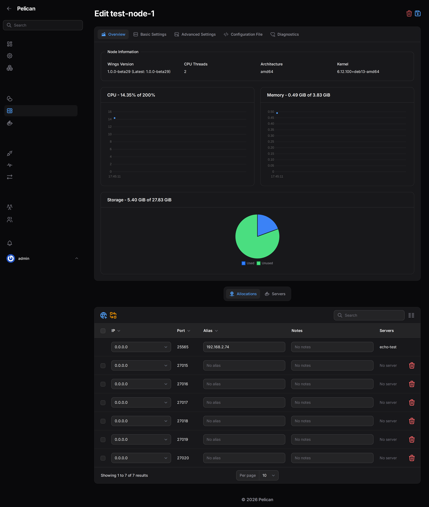

# Quick start

**What you'll have at the end:** a public address that players can connect to, which forwards to your game server
without you opening any ports on your router or showing your home IP.

This is the long version of the steps on the [README](../README.md), with something to check after each one. If a
check fails, jump to [troubleshooting.md](troubleshooting.md). Every symptom there names the command to run next.

Every command below with angle brackets (`<join code>`) is a placeholder. The plugin fills in the real value; you
never type it from memory.

## Before you start

You need:

- A VPS with a public IPv4 address, root SSH access, running Debian 12 or 13. Tested live on Debian 13; Debian 12 is
  expected to work but has not been tested yet. Ubuntu is not supported in this release. See the FAQ for why.
- One or more machines running your game servers (via Pelican Wings) on the same platforms, also with root access.
- A Pelican Panel where you can sign in as a root admin and import a plugin zip.

The VPS and your game server machines do not need to reach each other directly, only the VPS needs a public IP.
Your game server machines dial out to it, the same way your laptop dials out to a website; nothing has to be able
to reach them first.

The "about five minutes" this guide is timed at comes from a first-time run against a clean setup (a fresh VPS and
a fresh game server machine, end to end, following only this page). Your run may be faster or slower.

## Step 1: install the agent on the VPS

SSH into the VPS as root (or a user who can `sudo`) and run:

```bash
curl -fsSL https://github.com/finnwastakenwastaken/pelican-auto-proxy/releases/latest/download/install-vps.sh | sudo bash
```

A minimal Debian image may have no `curl`. If the command above says `curl: command not found`, run
`sudo apt-get install -y curl ca-certificates` once and repeat it.

This sets up the tunnel software and firewall rules on the VPS, generates a private token and certificate (used
later so only your panel can control this VPS), opens the two ports it needs, and starts the service. It ends by
printing a boxed **VPS code**: a block of text containing everything the plugin needs to connect to this VPS. Copy
the whole block.

The installer also writes the same information to a file on the VPS that only root can read, so losing the copy you
made is not fatal, see "how to re-print the VPS code" in [install-vps.md](install-vps.md).

**How to verify:** run `sudo autoproxy-agent show-code` on the VPS. It should print the same block again. Run
`systemctl status autoproxy-agent wg-quick@wg0`. Both should say `active (running)`. (`wg0` is the name of the
tunnel connection on the VPS; your game server machines will use a differently named one, `autoproxy0`.)

## Step 2: connect the plugin to the VPS

In your Pelican Panel: **Admin → Plugins → Import**, upload the Auto Proxy plugin zip, then press **Install** on its
row. Once installed, open **Admin → Auto Proxy → Setup**.

Paste the VPS code from step 1 into the box on step 1 of the Setup page and press **Test connection**.


**How to verify:** the Setup page shows a green "connected" state with the agent's version. If it stays red, the
panel could not reach the VPS on its API port (default 7443). Check that the port is open from wherever the panel
runs, not just from the VPS itself.

## Step 3: add a node

A "node" here means a machine running your game servers. Step 2 of the Setup page lists your Pelican nodes. For
each one you want reachable from the internet, mark it proxied and choose a mode:

- **This host runs the tunnel client** (real mode): players see their real IP. Pick this when your game servers
  run on the same machine you are about to run the join command on. This is the setup most people want.
- **Forwarded from another host on this network** (site mode): pick this when this node is only reachable through
  another machine that already runs, or will run, the tunnel client; you provide that machine's address on your
  local network.

The plugin then shows a join command for that node, in two flavours:


```bash
curl -fsSL https://github.com/finnwastakenwastaken/pelican-auto-proxy/releases/latest/download/install-client.sh | sudo bash -s -- <join code>
```

or, for Docker Compose, a snippet with `AUTOPROXY_JOIN_CODE=<join code>` set as an environment variable. Run
whichever fits on that node's host, as root.

A node that already has a public IP you control can be left out of this step. Players reach it directly, and you
only add it here if you want one public address for everything or want its IP hidden. See
[is this node local or remote?](install-client.md#is-this-node-local-or-remote).

**How to verify:** run `sudo autoproxy-client status` on the node's machine. It should report a successful
connection under a couple of minutes old. Back in the plugin, the Setup page (and the Status page) shows the same
node as connected within a minute of the client starting. Refresh if it still says "never joined".

## Step 4: make a port public

On step 3 of Setup you can set a public hostname (optional; without one, players are shown the VPS's own IP) and
confirm the alias keywords (`proxy` and `public` by default).

To publish a port: **Admin → Nodes → (your node) → Allocations**, and type `proxy` or `public` in the **Alias**
column for the allocation you want open. This only takes effect once a game server is assigned to that allocation.
One with the alias but no server assigned keeps the alias but forwards nothing.



**How to verify:** within a minute, **Admin → Auto Proxy → Forwards** lists the allocation with a target and the
public hostname or VPS IP shown in its alias. From another network (not the VPS's own, not your game server's local
network), connect to that address and port with the game client, or with `nc -vz <address> <port>` for a quick
reachability check.


## You're done

Clearing the alias closes the port again within a minute. Adding more nodes repeats step 3 with a fresh join code
each time: each node connects with its own code. A join code stays valid until you rotate that node's key or remove
it from the Setup page, so treat it like a password, not a one-time code.

If anything above did not match what you saw, [troubleshooting.md](troubleshooting.md) is organised by symptom, not
by step.
