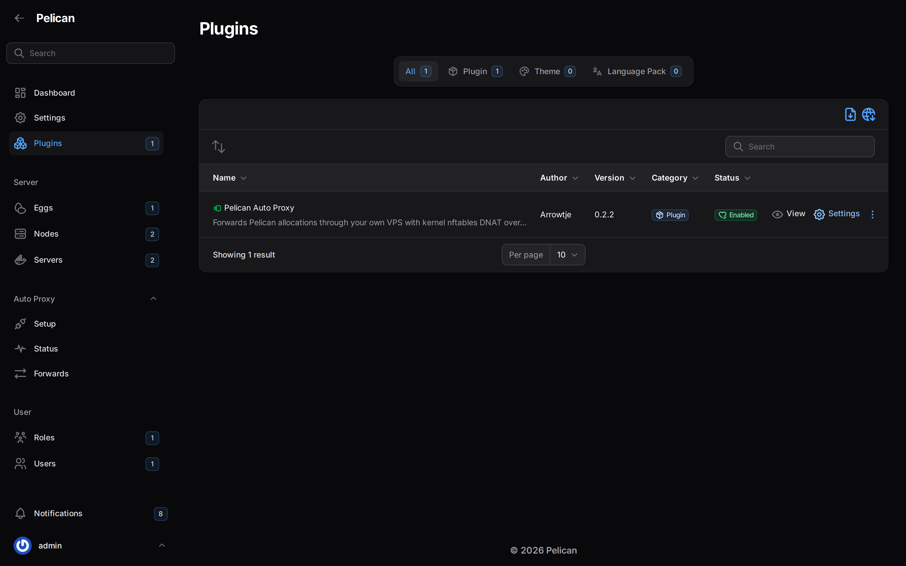

# Updating

Each of the three parts updates independently — you do not need to update the VPS, every node, and the plugin at
the same time, though checking the [changelog](../CHANGELOG.md) for breaking notes before mixing old and new
versions for long is worth the minute it takes.



## VPS agent

Re-run the installer:

```bash
curl -fsSL https://github.com/finnwastakenwastaken/pelican-auto-proxy/releases/latest/download/install-vps.sh | sudo bash
```

This downloads the latest checksummed binary and runs setup again. Setup is idempotent: it never regenerates your
existing token, certificate or WireGuard key, so nothing already forwarding needs to be reconfigured, and no
existing peer needs to rejoin. It only refreshes derived config (units, base firewall tables) if something about how
setup renders them has changed.

To pin a version instead of taking the latest, set `AUTOPROXY_VERSION` to a release tag:

```bash
curl -fsSL https://github.com/finnwastakenwastaken/pelican-auto-proxy/releases/latest/download/install-vps.sh \
  | sudo AUTOPROXY_VERSION=v1.2.3 bash
```

See [dev/release.md](dev/release.md) for how versions are tagged.

## Node client

Same pattern, on each node host:

```bash
curl -fsSL https://github.com/finnwastakenwastaken/pelican-auto-proxy/releases/latest/download/install-client.sh | sudo bash -s -- <join code>
```

Re-run it with the **same** join code you used the first time: `install` always rewrites `/etc/autoproxy/client.json`
and `/etc/wireguard/autoproxy0.conf` from whatever code you hand it, so the same code gives the same peer, the same
keys and the same tunnel IP, and only the script and the unit are refreshed. Use a fresh code from the plugin only
if you deliberately rotated that node's key — a rotate replaces the peer's keys, so the old code stops working.
Re-running install does not prompt when it is piped from `curl` (no terminal attached); pass `--yes` if you want it
non-interactive anywhere else, or `--no-start` to stage the update without restarting the tunnel.
`AUTOPROXY_VERSION` pins the client the same way it pins the agent. For the Docker flavour, pull the new image tag
and recreate the container; the same `AUTOPROXY_JOIN_CODE` environment variable keeps it tied to the same peer.

## Plugin

Pelican's one-click plugin update only appears when a plugin publishes an `update_url` the panel can poll — Auto
Proxy's `plugin.json` sets this, but until the hub listing is live, updating is a manual re-import, the same as a
first install:

1. Download (or build) the new version's zip.
2. **Admin → Plugins → Import**, upload it. Because the zip's plugin id (`autoproxy`) matches the plugin already on
   disk, the panel replaces the old plugin folder with the new one — nothing is merged by hand.
3. The plugin row reads "Not installed" again after a re-import; press **Install**, same as a first install. This is
   a queued job, so it needs the panel's queue worker (or scheduler-driven queue) running — the same dependency the
   sync banner already tells you about if it's down.
4. Confirm the plugin is still **enabled** afterwards; a re-import occasionally resets that flag.

**What survives a plugin update:** your Setup configuration (VPS endpoint, token, certificate), every node's mode
and peer state, manual forwards, and settings — these live in the plugin's own database tables, which Laravel's
migrator only ever adds to for a new version, never drops or recreates. You will not need to re-paste the VPS code
or re-run any join command just because the plugin itself updated.
